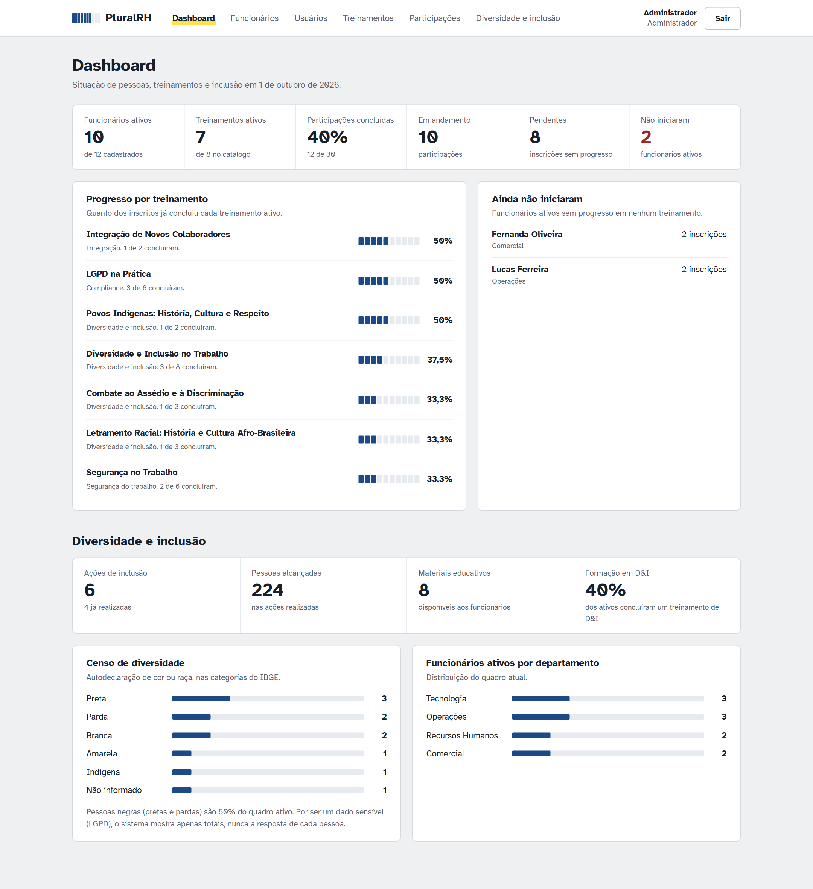
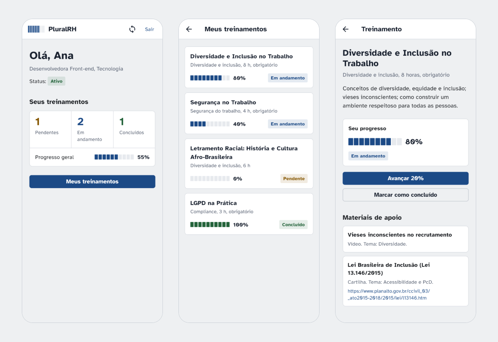
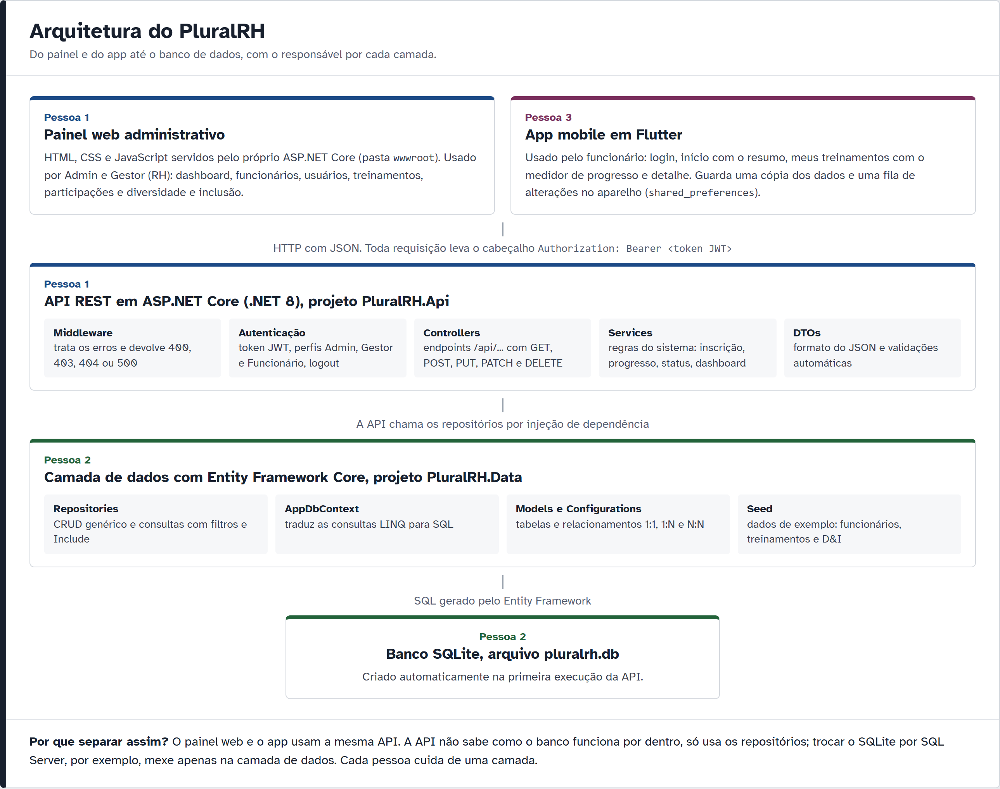

# PluralRH

Plataforma para uma empresa gerenciar **funcionários**, **treinamentos** e **ações de diversidade e inclusão**, com painel web para o RH e aplicativo para o funcionário acompanhar os próprios treinamentos.

Projeto Integrado Multidisciplinar (**PIM VI**). Todos os dados do sistema são fictícios.





---

## O problema e a solução

Uma empresa fictícia não conseguia acompanhar quem fez cada treinamento, quem ainda não começou e o que estava sendo feito em diversidade e inclusão. As informações ficavam espalhadas e não havia indicadores.

O PluralRH junta tudo em um sistema com três partes:

| Parte | Quem usa | O que faz |
|-------|----------|-----------|
| Painel web | Admin e Gestor (RH) | Dashboard, funcionários, usuários, treinamentos, participações e diversidade e inclusão |
| App mobile | Funcionário | Login, início com o resumo ("Olá, Ana"), lista de treinamentos com o progresso e modo offline |
| API REST | Os dois acima | Autenticação, controle de acesso, regras do sistema e acesso ao banco |

## Funcionalidades

| Módulo | O que dá para fazer |
|--------|---------------------|
| Autenticação | Login, logout com revogação do token, bloqueio de usuário desativado, controle de acesso por perfil |
| Usuários | Cadastrar, editar, consultar, desativar e definir o tipo (Admin, Gestor, Funcionário) |
| Funcionários | Cadastrar, editar, consultar, desativar, excluir sem histórico, filtrar por departamento e ver o histórico |
| Treinamentos | Criar, editar, excluir, visualizar, ativar, desativar e categorizar |
| Participações | Inscrever, acompanhar o progresso, concluir, cancelar e consultar o histórico |
| Diversidade e inclusão | Materiais educativos, ações de inclusão e acompanhamento dos treinamentos de D&I, com base nas Leis 10.639/2003 e 11.645/2008 |
| Dashboard | Funcionários, treinamentos, concluídos, pendentes, quem não iniciou e indicadores de D&I |
| App | Resumo do funcionário, "Meus treinamentos", avanço de progresso e funcionamento sem internet |

## Tecnologias

- **Back-end:** C#, .NET 8, ASP.NET Core (API REST), autenticação JWT, Swagger
- **Banco de dados:** Entity Framework Core 8 com SQLite
- **Painel web:** HTML, CSS e JavaScript (módulos ES), sem framework, servido pela própria API
- **Mobile:** Flutter e Dart, com os pacotes `http` e `shared_preferences`
- **Fonte:** Atkinson Hyperlegible, criada pelo Braille Institute para leitores com baixa visão

## Arquitetura



O painel web e o app usam a mesma API. A API não conhece o banco por dentro: fala com ele pelos repositórios da camada de dados. O diagrama de entidades e o fluxo de uma requisição estão em [`prints/6_diagramas`](prints/6_diagramas).

### Decisões técnicas

- **Regras na API e no banco.** Inscrição duplicada, progresso fora de 0 a 100 e e-mail repetido são barrados pelo serviço e também por índices únicos e CHECK no banco.
- **Status calculado, não digitado.** O status da participação sai do progresso (0% Pendente, 1 a 99% Em andamento, 100% Concluído), então não existe "Concluído com 40%".
- **Logout de verdade com JWT.** O token encerrado entra numa lista de revogados e é recusado até vencer. Um usuário desativado perde o acesso na hora.
- **O funcionário só vê o que é dele.** Nos endpoints do app, o funcionário é identificado pelo token, nunca por um id na URL.
- **App que funciona offline.** O app guarda uma cópia dos dados e uma fila de alterações; quando a conexão volta, envia a fila e a API decide se aceita.
- **Dado sensível tratado com cuidado.** A autodeclaração de cor ou raça (categorias do IBGE) é opcional e só aparece em totais, como pede a LGPD.

## Como rodar

O passo a passo completo, do zero e com solução de problemas, está em **[docs/COMO_RODAR.md](docs/COMO_RODAR.md)**.

Resumo para quem já tem o [.NET 8 SDK](https://dotnet.microsoft.com/download/dotnet/8.0) e o [Flutter](https://docs.flutter.dev/install/archive) instalados:

```bash
cd backend
dotnet run --project PluralRH.Api
```

Com a API rodando, abra **http://localhost:5080** (painel) ou **http://localhost:5080/swagger** (API). Em outro terminal:

```bash
cd mobile/pluralrh_app
flutter pub get
flutter run -d chrome
```

### Usuários de teste

| Perfil | E-mail | Senha | Onde entra |
|--------|--------|-------|------------|
| Admin | `admin@pluralrh.com` | `Admin@123` | Painel web |
| Gestor (RH) | `carla.mendes@pluralrh.com` | `Gestor@123` | Painel web |
| Funcionária | `ana.souza@pluralrh.com` | `Func@123` | App |
| Funcionário | `igor.nakamura@pluralrh.com` | `Func@123` | App |
| Funcionária desativada | `mariana.alves@pluralrh.com` | `Func@123` | É bloqueada (demonstra a validação) |

## Estrutura do repositório

```
backend/
  PluralRH.sln
  PluralRH.Api/       API REST, autenticação, regras do sistema e painel web (wwwroot)
  PluralRH.Data/      Entity Framework: models, relacionamentos, repositórios e dados de exemplo
mobile/
  pluralrh_app/       app Flutter do funcionário
docs/
  COMO_RODAR.md       passo a passo para rodar o projeto
  API_ENDPOINTS.md    todas as rotas da API e quem pode usar cada uma
  GUIA_POR_PESSOA.md  o que cada integrante do grupo usa do projeto
  MAPA_DISCIPLINAS.md onde cada disciplina aparece no código
prints/               capturas de tela, prints de código e diagramas (índice em prints/LEIA-ME.md)
```

## Prints para o trabalho

A pasta [`prints`](prints/LEIA-ME.md) tem mais de 150 imagens geradas a partir do código e do sistema rodando:

- por pessoa do grupo e por disciplina;
- por área do sistema, com **as linhas de código de cada funcionalidade grifadas e explicadas**;
- telas do painel web, do Swagger e do app;
- diagramas de arquitetura, de entidades e de fluxo.

## Divisão do grupo

| Integrante | Responsabilidade |
|------------|------------------|
| Pessoa 1 | ASP.NET Core, API REST, autenticação e autorização, regras do sistema, painel web |
| Pessoa 2 | Entity Framework, banco de dados, models e relacionamentos, CRUD |
| Pessoa 3 | Flutter, telas mobile, consumo da API, armazenamento local, sincronização |
| Vitor | Modelo de negócio, proposta de valor, mercado, concorrência, financeiro e viabilidade |
| Pessoa 5 | Diversidade e inclusão, Leis 10.639/2003 e 11.645/2008, ações contra discriminação |
| Pessoa 6 | Documentação técnica, arquitetura, prints e revisão ABNT |

Disciplinas integradas: Desenvolvimento Web com .NET, Desenvolvimento Mobile, Relações Étnico-Raciais e Afrodescendência, e Empreendedorismo em TI. Detalhes em [docs/MAPA_DISCIPLINAS.md](docs/MAPA_DISCIPLINAS.md).
# Pim-VI
